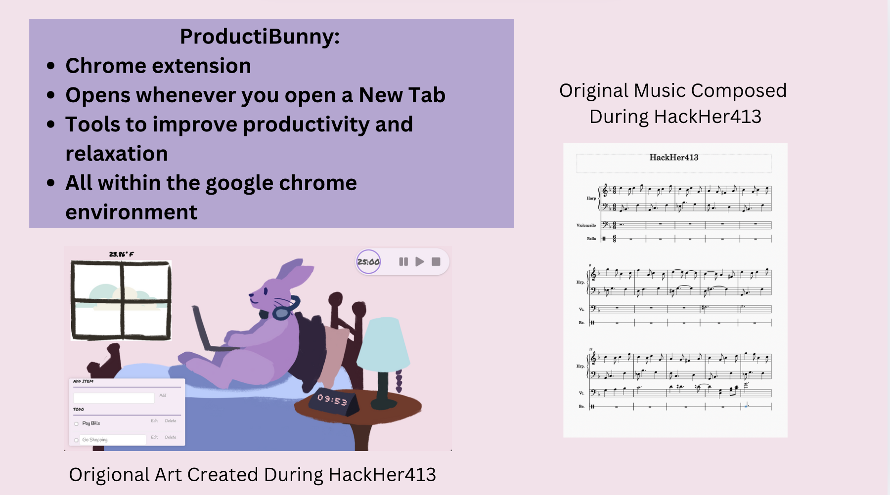

# ProductiBunny: Redefining Productivity, One Tab at a Time 🐰

## 🚀 Introduction

Conventional productivity tools, like focus timers or to-do list apps on your phone or desktop, can often feel more like distractions. They pull your attention away from what truly matters—the work and research you're doing in your browser.

Enter **ProduciBunny**—a game-changing Chrome extension designed to transform your browser experience into a seamless productivity hub. With **ProduciBunny**, every new tab becomes an opportunity to enhance focus without the need to juggle multiple apps or tools.

## 🖥️ How It Works

Whenever you open a new tab in your browser, ProduciBunny turns the idle space on the search screen into an interactive productivity hub, featuring:

- **Geo-located weather information** 🌦️  
- **To-do list** 📝  
- **Pomodoro timer** 🍅  
- **Study music playlist** 🎶

All of these tools are neatly integrated into a calm and soothing interface that’s designed to help you stay on track—no need to unlock your phone or launch apps. 

## 🎯 Features

- **One-click access**: Instantly launch productivity tools right from your browser tab.
- **Weather updates**: Stay on top of the weather with geo-located forecasts, right at your fingertips.
- **To-do list**: Keep your tasks organized and in sight, so you never forget what's next.
- **Pomodoro timer**: Boost focus with a built-in Pomodoro timer to break tasks into manageable chunks.
- **Study music**: Enjoy curated playlists designed to help you concentrate and stay productive.

## 🌟 Why ProduciBunny?

Traditional productivity tools require you to leave your current workflow, distract you with notifications, or take up precious space on your phone or computer. **ProduciBunny** integrates everything you need into one streamlined experience, so you can focus on what really matters—your work.

Whether you're a student trying to power through a study session or a professional aiming to stay sharp, **ProduciBunny** is your non-intrusive, one-click solution to boosting productivity.

## 📦 Installation

1. **Download the extension** from the Chrome Web Store.
2. **Install it** and pin it to your browser toolbar.
3. **Open a new tab** and let ProduciBunny work its magic!

## 👨‍💻 Usage

Once installed, every time you open a new tab, you'll be greeted with your personal productivity hub. From here, you can:

- Check the weather to plan your day.
- Stay on top of your tasks with the built-in to-do list.
- Set your Pomodoro timer for uninterrupted focus time.
- Listen to soothing study music to maintain concentration.

## 📱 No More Distractions

With **ProduciBunny**, the need to jump between apps or unlock your phone is gone. It’s the simplest, most convenient way to bring productivity into your browser without distractions.

## 🌱 Contribution
This project is built by an Amherst College team: Maryam Abuissa, Sherry Jiang, Emi Eliason, and Tina Zhang. 

---

With **ProduciBunny**, redefine your productivity without leaving your browser. 🐰

